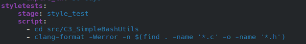

## Basic CI/CD

## Part 1. Настройка gitlab-runner

- установил гитлаб раннер

- поставил ключ

## Part 2. Сборка

- написал ямл файл для этапов сборки 

## Part 3. Тест кодстайла

- проверка на кленг

## Part 4. Интеграционные тесты

- тесты 

## Part 5. Этап деплоя

- Соединил сети между собой через netplan

## Part 6. Bonus

- тг бот для отслеживания процесса деплоя и сборки 

